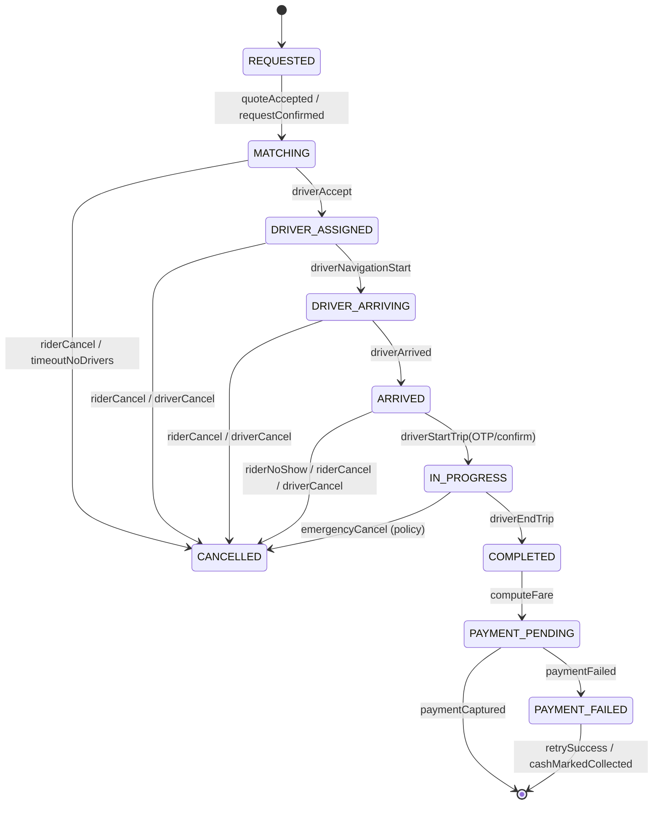
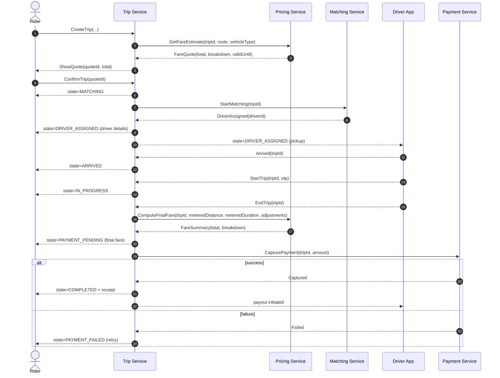

# Design: Ride-Sharing App (Uber/Ola)

**Focus areas:** Driver–rider matching · Trip lifecycle (state machine) · Pricing (estimate vs final fare, surge, fees) · Real-time location

---

## 1. Requirements (Clarifying Questions)

| Area | Questions |
|------|-----------|
| **Product scope** | Rides only, or also rentals, intercity, deliveries? Scheduled rides? Multi-stop? |
| **Fleet** | Car only, or 2W/Auto/XL/Lux? Driver categories (pro, women-only, accessibility)? |
| **Matching SLA** | Target “time to match” (p50/p95)? Max dispatch radius? Re-try strategy? |
| **Pricing** | Dynamic pricing (surge)? Upfront pricing vs metered? Tolls/parking? Cancellation fees? |
| **Payments** | Cash/UPI/cards/wallet? Pre-auth vs post-pay? Tips? Split fare? |
| **Maps & ETA** | Which map provider? Routing engine? ETA refresh rate? |
| **Trust & safety** | SOS, ride sharing, number masking, driver background checks, ratings. |
| **Reliability** | What if rider/driver app goes offline mid-trip? Idempotency? Event ordering? |
| **Scale** | Cities/regions, peak QPS, expected concurrent drivers online. |

**Assumptions for this design:** On-demand rides (no schedule), one pickup + one drop, upfront **estimated fare** shown to rider, **final fare** computed from measured distance/time with caps/adjustments, payments via card/UPI/wallet (cash supported but treated as a payment method), location updates every 1–5 seconds.

---

## 2. High-Level Architecture

We split the system by responsibilities: **Geo / matching**, **trip orchestration**, **pricing**, and **payments**, all driven by events.

```
┌──────────────────────────────┐          ┌──────────────────────────────┐
│ Rider App                    │          │ Driver App                   │
│ - request ride               │          │ - go online/offline          │
│ - track driver, trip status  │          │ - accept/arrive/start/end    │
└───────────────┬──────────────┘          └───────────────┬──────────────┘
                │                                         │
                │ HTTPS/WebSocket                         │ HTTPS/WebSocket
                ▼                                         ▼
┌────────────────────────────────────────────────────────────────────────┐
│ API Gateway                                                            │
└───────────────┬───────────────────────────────┬────────────────────────┘
                ▼                               ▼
┌──────────────────────────────┐       ┌──────────────────────────────┐
│ Trip Service (Orchestrator)  │       │ Driver Service               │
│ - trip state machine         │       │ - driver profile, vehicle    │
│ - idempotency + ordering     │       │ - availability state         │
└───────────────┬──────────────┘       └───────────────┬──────────────┘
                ▼                                      ▼
┌──────────────────────────────┐       ┌──────────────────────────────┐
│ Matching/Dispatch Service    │       │ Geo/Location Service         │
│ - candidate selection        │       │ - ingest location pings      │
│ - offers + timers            │       │ - geo index (nearby query)   │
└───────────────┬──────────────┘       └───────────────┬──────────────┘
                ▼                                      ▼
┌──────────────────────────────┐       ┌──────────────────────────────┐
│ Pricing Service              │       │ Maps/ETA Service             │
│ - estimate + final fare      │       │ - route, ETA, distance       │
└───────────────┬──────────────┘       └───────────────┬──────────────┘
                ▼                                      ▼
┌──────────────────────────────┐       ┌──────────────────────────────┐
│ Payment Service              │       │ Notifications                │
│ - preauth/capture/refund     │       │ - push/SMS/in-app            │
└──────────────────────────────┘       └──────────────────────────────┘

Event Bus (Kafka/PubSub): trip events, offer events, location events, payment events
Primary Storage: relational for trips/payments, geo store for driver positions, cache for hot reads
```

**Key principle:** the **Trip Service** owns the authoritative trip state; everything else is a side-effect driven by events (pricing updates, notifications, payment collection, analytics).

---

## 3. Core Entities & Relationships

```
Rider 1 ──* Trip *── 1 Driver
                 │
                 *── Offer (dispatch attempt)
                 │
                 *── LocationPoint (driver + optionally rider)
                 │
                 *── FareQuote (estimate) + FareBreakdown (final)
                 │
                 *── PaymentIntent / Payment
```

---

## 4. Schema (JSON)

### 4.1 Enums

```json
{
  "TripState": [
    "REQUESTED",
    "MATCHING",
    "DRIVER_ASSIGNED",
    "DRIVER_ARRIVING",
    "ARRIVED",
    "IN_PROGRESS",
    "COMPLETED",
    "CANCELLED",
    "PAYMENT_PENDING",
    "PAYMENT_FAILED"
  ],
  "OfferState": ["CREATED", "SENT", "ACCEPTED", "REJECTED", "EXPIRED", "CANCELLED"],
  "CancelSource": ["RIDER", "DRIVER", "SYSTEM"],
  "VehicleType": ["BIKE", "AUTO", "SEDAN", "SUV", "XL"],
  "PaymentMethod": ["CARD", "UPI", "WALLET", "CASH"],
  "SurgeState": ["NONE", "SURGE"]
}
```

### 4.2 Entity schemas (minimal)

```json
{
  "LatLng": { "lat": "number", "lng": "number" },
  "Money": { "amount": "number", "currency": "string" },

  "Rider": {
    "riderId": "string",
    "name": "string",
    "rating": "number",
    "defaultPaymentMethodId": "string | null"
  },

  "Driver": {
    "driverId": "string",
    "name": "string",
    "rating": "number",
    "vehicle": {
      "vehicleId": "string",
      "type": "VehicleType",
      "plate": "string"
    },
    "online": "boolean",
    "status": "AVAILABLE | ON_TRIP | OFFLINE"
  },

  "Trip": {
    "tripId": "string",
    "riderId": "string",
    "driverId": "string | null",
    "vehicleType": "VehicleType",
    "pickup": { "location": "LatLng", "address": "string" },
    "dropoff": { "location": "LatLng", "address": "string" },
    "requestedAt": "string",
    "state": "TripState",
    "stateVersion": "number",

    "route": {
      "estimatedDistanceMeters": "number",
      "estimatedDurationSeconds": "number",
      "polyline": "string | null"
    },

    "pricing": {
      "quoteId": "string | null",
      "surgeMultiplier": "number",
      "currency": "string",
      "estimate": "Money | null",
      "final": "Money | null"
    },

    "timestamps": {
      "driverAssignedAt": "string | null",
      "driverArrivedAt": "string | null",
      "startedAt": "string | null",
      "completedAt": "string | null",
      "cancelledAt": "string | null"
    }
  },

  "Offer": {
    "offerId": "string",
    "tripId": "string",
    "driverId": "string",
    "state": "OfferState",
    "createdAt": "string",
    "expiresAt": "string",
    "metadata": {
      "pickupDistanceMeters": "number",
      "pickupEtaSeconds": "number"
    }
  },

  "LocationPoint": {
    "entityType": "DRIVER | RIDER",
    "entityId": "string",
    "tripId": "string | null",
    "location": "LatLng",
    "bearing": "number | null",
    "speedMps": "number | null",
    "accuracyMeters": "number | null",
    "capturedAt": "string",
    "receivedAt": "string"
  },

  "FareQuote": {
    "quoteId": "string",
    "tripId": "string",
    "vehicleType": "VehicleType",
    "currency": "string",
    "surgeMultiplier": "number",
    "etaSeconds": "number",
    "distanceMeters": "number",
    "breakdown": {
      "base": "Money",
      "distance": "Money",
      "time": "Money",
      "surge": "Money",
      "fees": [{ "name": "string", "amount": "Money" }],
      "discounts": [{ "name": "string", "amount": "Money" }],
      "taxes": [{ "name": "string", "amount": "Money" }]
    },
    "total": "Money",
    "validUntil": "string"
  },

  "FareSummary": {
    "tripId": "string",
    "currency": "string",
    "metered": { "distanceMeters": "number", "durationSeconds": "number" },
    "breakdown": {
      "base": "Money",
      "distance": "Money",
      "time": "Money",
      "surge": "Money",
      "waitTime": "Money",
      "tolls": "Money",
      "cancellationFee": "Money",
      "fees": [{ "name": "string", "amount": "Money" }],
      "discounts": [{ "name": "string", "amount": "Money" }],
      "taxes": [{ "name": "string", "amount": "Money" }]
    },
    "total": "Money",
    "computedAt": "string"
  },

  "PaymentIntent": {
    "paymentIntentId": "string",
    "tripId": "string",
    "amount": "Money",
    "method": "PaymentMethod",
    "state": "CREATED | AUTHORIZED | CAPTURED | FAILED | CANCELLED | REFUNDED",
    "idempotencyKey": "string",
    "createdAt": "string",
    "updatedAt": "string"
  }
}
```

### 4.3 Trip event schema (append-only, ordered)

```json
{
  "TripEvent": {
    "eventId": "string",
    "tripId": "string",
    "type": "string",
    "stateVersion": "number",
    "timestamp": "string",
    "payload": "object"
  }
}
```

**Design choice:** `Trip.stateVersion` increments on every transition; consumers drop out-of-order events (accept only if `stateVersion` is greater than the last seen).

---

## 5. Driver Availability & Location (Geo)

### 5.1 Data model for fast nearby queries

- Driver app sends `LocationPoint` pings.
- Geo service maintains an in-memory/geo-indexed view:
  - `availableDrivers:{city}:{vehicleType}` indexed by geohash/H3 cell
  - per-driver last ping timestamp and quality score

### 5.2 Filtering rules for candidates

Before offering a trip, filter candidates by:

- **Availability**: online + AVAILABLE (not on-trip, not paused).
- **Vehicle type**: matches requested type.
- **Distance/ETA**: within radius and ETA threshold.
- **Quality**: stale location (e.g., last ping > 10s) excluded or penalized.
- **Constraints**: driver preferences, rider preferences, accessibility, safety, rating threshold (policy-driven).

---

## 6. Matching & Dispatch (Driver–Rider)

### 6.1 Goal

Minimize \( ETA_{pickup} \) while balancing:

- driver utilization (avoid starving distant areas),
- acceptance probability,
- fairness (avoid repeatedly pinging the same drivers),
- SLA: match within a deadline (e.g., 20–45 seconds).

### 6.2 Candidate selection (high-level)

1. Get N nearest available drivers from geo index (e.g., 50–200).
2. Score each candidate:
   - \( score = w_1 \cdot ETA + w_2 \cdot distance + w_3 \cdot (1 - pAccept) + w_4 \cdot fairnessPenalty \)
3. Create **offers** in small batches (e.g., 1 → 3 → 5 drivers), each with TTL (e.g., 10 seconds).
4. First accept wins; remaining offers are cancelled.

### 6.3 Offer flow (sequence)

```mermaid
sequenceDiagram
  autonumber
  actor R as Rider
  participant T as Trip Service
  participant M as Matching Service
  participant G as Geo Service
  participant D as Driver App
  participant N as Notifications

  R->>T: CreateTrip(pickup, dropoff, vehicleType, paymentMethod)
  T-->>R: TripCreated(tripId, state=MATCHING)
  T->>M: StartMatching(tripId)
  M->>G: NearbyDrivers(pickup, vehicleType, limit=100)
  G-->>M: driverIds[]

  loop offer batches
    M->>D: Offer(tripId, offerId, expiresAt)
    M->>N: Push offer to driver
    alt driver accepts
      D-->>M: Accept(offerId)
      M->>T: AssignDriver(tripId, driverId, offerId)
      T-->>R: state=DRIVER_ASSIGNED
      T-->>D: AssignmentConfirmed(tripId)
      break
    else expires / reject
      D-->>M: Reject(offerId) or timeout
      M->>T: OfferFailed(tripId, offerId)
    end
  end

  alt no driver found
    M-->>T: MatchFailed(tripId)
    T-->>R: NoDriversAvailable / RetrySuggestion
  end
```

### 6.4 Concurrency + idempotency for “first accept wins”

- `Accept(offerId)` must be **atomic**: only one offer can transition the trip to `DRIVER_ASSIGNED`.
- Implementation: Trip Service uses conditional update on `(tripId, stateVersion)`:
  - accept assignment only if `Trip.state == MATCHING` and `Offer.state == SENT` and `expiresAt > now`.
- Matching cancels all non-winning offers after assignment.

---

## 7. Trip Lifecycle (State Machine)

### 7.1 Main states



### 7.2 Trip lifecycle flow (end-to-end)



---

## 8. Pricing (Estimate + Final Fare)

### 8.1 Components of fare

Common components:

- **Base fare**: fixed per vehicle type/city.
- **Distance component**: \( ratePerKm \cdot distanceKm \)
- **Time component**: \( ratePerMin \cdot durationMin \)
- **Surge**: multiplier applied to some or all components.
- **Fees**: platform fee, booking fee, airport fee, etc.
- **Taxes**: GST/VAT.
- **Discounts**: promo codes, wallet cashbacks.
- **Waiting time**: charged after free waiting window.
- **Tolls/Parking**: pass-through.

### 8.2 Upfront estimate vs final fare

- **Estimate** (shown pre-trip):
  - uses planned route distance/time from maps + current traffic model
  - uses current surge multiplier and fees
  - has `validUntil` (surge/traffic can change)
- **Final fare** (post-trip):
  - uses metered distance/time from the actual path (with map-matching)
  - includes tolls/parking (manual or provider)
  - applies caps/guards:
    - max deviation allowed before rider notification
    - rounding rules
    - dispute handling

### 8.3 Surge pricing (simple model)

Let:

- \( D \) = demand in a zone (active ride requests)
- \( S \) = supply in a zone (available drivers)
- \( r = \frac{D}{S + \epsilon} \)

Define surge multiplier:

\[
multiplier = clamp(1, maxSurge, 1 + k \cdot (r - 1))
\]

Where \(k\) and `maxSurge` are tuned per city/time. In practice, surge is computed per **zone** (grid/H3) and smoothed over time to prevent oscillations.

### 8.4 Pricing APIs (conceptual)

- `GetFareEstimate(tripId, pickup, dropoff, vehicleType, timeNow)` → `FareQuote`
- `ComputeFinalFare(tripId, meteredDistance, meteredDuration, tolls, adjustments)` → `FareSummary`
- `GetSurgeMultiplier(zoneId, vehicleType, timeNow)` → multiplier

---

## 9. Cancellation & Fees

### 9.1 Cancellation rules (examples)

- Rider cancels in `MATCHING`: no fee.
- Rider cancels after `DRIVER_ASSIGNED` and driver is en route:
  - fee if grace window passed (e.g., 2 minutes) or driver is within threshold distance.
- Rider no-show after driver `ARRIVED`:
  - charge no-show fee; optionally compensate driver.
- Driver cancels frequently:
  - penalize in ranking / temporary lockout.

### 9.2 Cancellation flow

- Cancellation is a state transition to `CANCELLED` with `CancelSource` and reason.
- Pricing service computes applicable `cancellationFee`.
- Payment service captures fee (or marks cash due).

---

## 10. Data consistency & failure handling (high-signal)

### 10.1 Event ordering & duplicates

- All write APIs are **idempotent** via `Idempotency-Key` (client-generated).
- Trip Service publishes `TripEvent` with monotonically increasing `stateVersion`.
- Consumers keep last processed `stateVersion` per `tripId`; drop older events.

### 10.2 Rider/driver offline mid-trip

- Driver app caches last actions and retries with same idempotency key.
- Trip continues based on driver’s periodic pings; if pings stop:
  - degrade UI; attempt reconnect; allow “end trip” to be posted later with evidence.

### 10.3 “Double assignment” avoidance

- Trip Service is the single writer for `Trip.driverId`.
- Matching service never writes trip state directly; it requests assignment and receives a success/failure.

---

## 11. Storage notes (practical)

- **Trips/Offers/Payments**: relational DB (strong consistency, transactions for assignment).
- **Driver locations**: geo store / in-memory (Redis GEO, PostGIS, or H3 index + KV), optimized for read-heavy nearby queries.
- **Event bus**: partition by `tripId` to preserve ordering for trip streams.

---

## 12. Testing focus (matching + lifecycle + pricing)

- **First accept wins**: concurrent accepts, expiry boundary, retries.
- **State machine**: invalid transitions rejected; version-based concurrency works.
- **Pricing**: estimate validity; surge changes; final fare vs estimate deviation policy.
- **Cancellation**: fee correctness by state/time; no-show timer.
- **Idempotency**: duplicate `CreateTrip`, `AcceptOffer`, `StartTrip`, `EndTrip`, `CapturePayment`.

