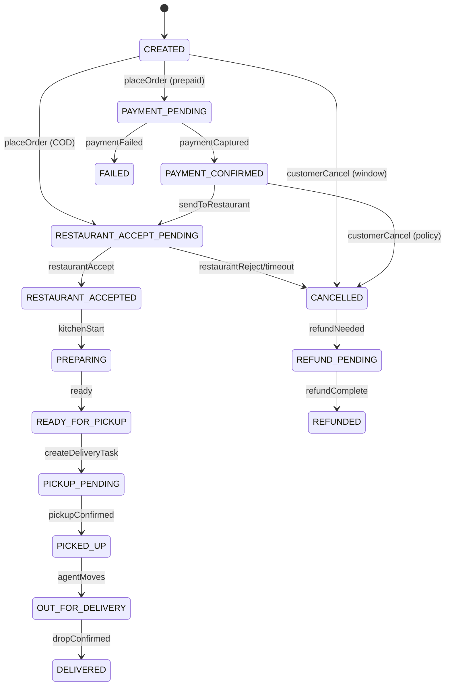
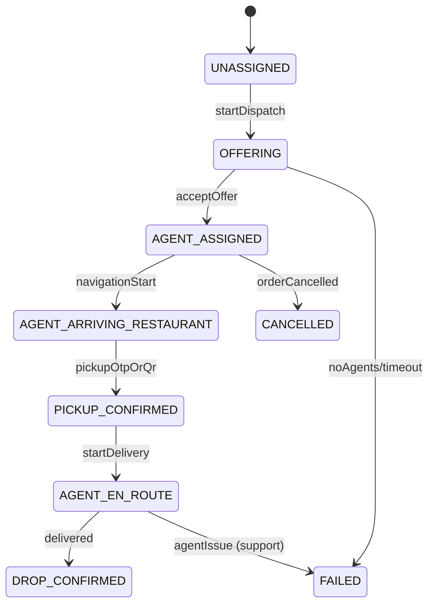
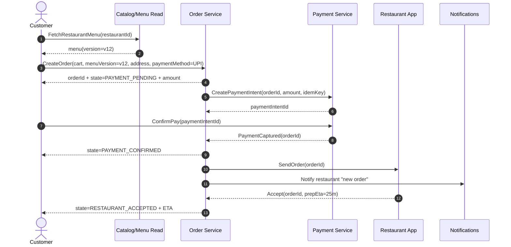

# Design: Food Delivery System (Swiggy/Zomato)

**Focus areas:** Orders · Restaurant menus · Delivery agent assignment · Real-time tracking · UI flows (Customer + Restaurant + Delivery Agent)

---

## 1. Requirements (Clarifying Questions)

| Area | Questions |
|------|-----------|
| **Scope** | Food only, or also grocery/medicine? Scheduled orders? Group orders? |
| **Restaurants** | Single outlet vs multi-outlet chains? Menu availability windows? Item-level stock? |
| **Ordering** | Customizations/add-ons? Special instructions? Substitutions? |
| **Delivery** | Self-pickup? Multi-order batching? Max delivery radius? |
| **Payments** | Prepaid only or also COD? Tips? Refunds and partial refunds? |
| **SLA** | Order acceptance SLA, prep time SLA, delivery ETA accuracy targets. |
| **Cancellations** | When can customer cancel? Cancellation fee? Restaurant cancellation? |
| **Tracking** | Live map always, or only after pickup? GPS update rate? |
| **Scale** | Peak QPS, concurrent users/agents, hot cities/areas. |

**Assumptions for this design:** On-demand food delivery (no scheduling), single restaurant per order, prepaid + COD supported, menu has item customization, delivery assignment is “first accept wins”, tracking via WebSocket (polling fallback).

---

## 2. High-Level Architecture

We separate **read-heavy** restaurant/menu browsing from **write-heavy** ordering, and treat the **Order Service** as the state machine owner (authoritative order state).

```
┌───────────────────────┐           ┌────────────────────────┐          ┌───────────────────────┐
│ Customer App (iOS/Web)│           │ Restaurant Partner App │          │ Delivery Agent App    │
│ - browse, cart, pay   │           │ - accept, prep, handoff│          │ - accept, pickup, drop│
└───────────┬───────────┘           └───────────┬────────────┘          └───────────┬───────────┘
            │ HTTPS / WebSocket                 │ HTTPS / WebSocket                 │ HTTPS / WebSocket
            ▼                                   ▼                                   ▼
┌─────────────────────────────────────────────────────────────────────────────────────────────┐
│ API Gateway                                                                                 │
└───────────────┬───────────────────────────────┬───────────────────────────────┬─────────────┘
                ▼                               ▼                               ▼
┌───────────────────────────┐      ┌─────────────────────────────┐      ┌───────────────────────────┐
│ Restaurant Catalog Service│      │ Order Service (Orchestrator)│      │ Dispatch/Matching Service │
│ - search/list restaurants │      │ - order state machine       │      │ - agent offers + timers   │
│ - menu read models        │      │ - totals, fees, taxes       │      │ - batching (optional)     │
└───────────────┬───────────┘      └──────────────┬──────────────┘      └──────────────┬────────────┘
                ▼                                 ▼                                    ▼
┌───────────────────────────┐      ┌───────────────────────────┐      ┌───────────────────────────┐
│ Menu Service (Write)      │      │ Payment Service           │      │ Geo/Location Service      │
│ - menu CRUD + validation  │      │ - intent/capture/refund   │      │ - agent pings + nearby    │
└───────────────┬───────────┘      └──────────────┬────────────┘      └──────────────┬────────────┘
                ▼                                 ▼                                  ▼
         ┌──────────────┐                  ┌───────────────┐             ┌──────────────────────┐
         │ Search Index │                  │ Event Bus     │             │ Notifications        │
         │ (restaurants)│                  │ (Kafka/PubSub)│             │ push/SMS/in-app      │
         └──────────────┘                  └───────────────┘             └──────────────────────┘
```

**Event bus topics (examples):** `menu.updated`, `order.created`, `order.stateChanged`, `payment.*`, `dispatch.offer.*`, `agent.location`.

---

## 3. Core Entities & Relationships

```
Customer 1 ──* Order *── 1 Restaurant
                 │
                 *── OrderItem *── MenuItem
                 │
                 *── PaymentIntent/Payment
                 │
                 1── DeliveryTask 1── DeliveryAgent (optional until assigned)
```

---

## 4. Schema (JSON)

### 4.1 Enums

```json
{
  "OrderState": [
    "CREATED",
    "PAYMENT_PENDING",
    "PAYMENT_CONFIRMED",
    "RESTAURANT_ACCEPT_PENDING",
    "RESTAURANT_ACCEPTED",
    "PREPARING",
    "READY_FOR_PICKUP",
    "PICKUP_PENDING",
    "PICKED_UP",
    "OUT_FOR_DELIVERY",
    "DELIVERED",
    "CANCELLED",
    "REFUND_PENDING",
    "REFUNDED",
    "FAILED"
  ],
  "RestaurantOrderAction": ["ACCEPT", "REJECT"],
  "PaymentMethod": ["CARD", "UPI", "WALLET", "COD"],
  "PaymentState": ["CREATED", "AUTHORIZED", "CAPTURED", "FAILED", "CANCELLED", "REFUNDED"],
  "DeliveryTaskState": [
    "UNASSIGNED",
    "OFFERING",
    "AGENT_ASSIGNED",
    "AGENT_ARRIVING_RESTAURANT",
    "PICKUP_CONFIRMED",
    "AGENT_EN_ROUTE",
    "DROP_CONFIRMED",
    "FAILED",
    "CANCELLED"
  ],
  "OfferState": ["CREATED", "SENT", "ACCEPTED", "REJECTED", "EXPIRED", "CANCELLED"]
}
```

### 4.2 Entity schemas (minimal)

```json
{
  "Money": { "amount": "number", "currency": "string" },
  "LatLng": { "lat": "number", "lng": "number" },

  "Customer": {
    "customerId": "string",
    "name": "string",
    "phone": "string",
    "defaultAddressId": "string | null"
  },

  "Address": {
    "addressId": "string",
    "label": "HOME | WORK | OTHER",
    "line1": "string",
    "line2": "string | null",
    "city": "string",
    "pincode": "string",
    "location": "LatLng",
    "instructions": "string | null"
  },

  "Restaurant": {
    "restaurantId": "string",
    "name": "string",
    "outletId": "string",
    "location": "LatLng",
    "serviceableRadiusKm": "number",
    "cuisines": ["string"],
    "isOpen": "boolean",
    "prepTimeBaselineMinutes": "number",
    "rating": "number"
  },

  "Menu": {
    "menuId": "string",
    "restaurantId": "string",
    "version": "number",
    "updatedAt": "string",
    "categories": [
      {
        "categoryId": "string",
        "name": "string",
        "items": ["MenuItem"]
      }
    ]
  },

  "MenuItem": {
    "itemId": "string",
    "name": "string",
    "description": "string | null",
    "imageUrl": "string | null",
    "isVeg": "boolean",
    "basePrice": "Money",
    "available": "boolean",
    "optionGroups": [
      {
        "groupId": "string",
        "name": "string",
        "minSelect": "number",
        "maxSelect": "number",
        "options": [
          {
            "optionId": "string",
            "name": "string",
            "priceDelta": "Money",
            "available": "boolean"
          }
        ]
      }
    ],
    "addons": [
      {
        "addonId": "string",
        "name": "string",
        "price": "Money",
        "available": "boolean"
      }
    ]
  },

  "Cart": {
    "cartId": "string",
    "customerId": "string",
    "restaurantId": "string",
    "menuVersion": "number",
    "items": [
      {
        "itemId": "string",
        "quantity": "number",
        "selectedOptions": [{ "groupId": "string", "optionIds": ["string"] }],
        "selectedAddons": ["string"],
        "itemNote": "string | null"
      }
    ],
    "pricingPreview": {
      "itemsTotal": "Money",
      "deliveryFee": "Money",
      "packagingFee": "Money",
      "tax": "Money",
      "discount": "Money",
      "grandTotal": "Money"
    },
    "updatedAt": "string"
  },

  "Order": {
    "orderId": "string",
    "customerId": "string",
    "restaurantId": "string",
    "menuVersion": "number",
    "state": "OrderState",
    "stateVersion": "number",
    "createdAt": "string",
    "updatedAt": "string",

    "deliveryAddress": "Address",
    "items": [
      {
        "orderItemId": "string",
        "itemId": "string",
        "nameSnapshot": "string",
        "basePriceSnapshot": "Money",
        "quantity": "number",
        "optionsSnapshot": [{ "name": "string", "priceDelta": "Money" }],
        "addonsSnapshot": [{ "name": "string", "price": "Money" }],
        "itemNote": "string | null",
        "lineTotal": "Money"
      }
    ],

    "pricing": {
      "itemsTotal": "Money",
      "deliveryFee": "Money",
      "packagingFee": "Money",
      "tax": "Money",
      "discount": "Money",
      "tip": "Money",
      "grandTotal": "Money"
    },

    "customerNote": "string | null",
    "restaurantPrepEtaMinutes": "number | null",
    "deliveryEtaMinutes": "number | null"
  },

  "PaymentIntent": {
    "paymentIntentId": "string",
    "orderId": "string",
    "amount": "Money",
    "method": "PaymentMethod",
    "state": "PaymentState",
    "idempotencyKey": "string",
    "createdAt": "string",
    "updatedAt": "string"
  },

  "DeliveryAgent": {
    "agentId": "string",
    "name": "string",
    "vehicleType": "BIKE | SCOOTER | CAR",
    "online": "boolean",
    "status": "AVAILABLE | ON_TASK | OFFLINE",
    "rating": "number"
  },

  "DeliveryTask": {
    "taskId": "string",
    "orderId": "string",
    "restaurantId": "string",
    "pickupLocation": "LatLng",
    "dropLocation": "LatLng",
    "agentId": "string | null",
    "state": "DeliveryTaskState",
    "stateVersion": "number",
    "createdAt": "string",
    "updatedAt": "string"
  },

  "DispatchOffer": {
    "offerId": "string",
    "taskId": "string",
    "agentId": "string",
    "state": "OfferState",
    "createdAt": "string",
    "expiresAt": "string",
    "metadata": {
      "distanceToPickupMeters": "number",
      "etaToPickupSeconds": "number",
      "payoutEstimate": "Money"
    }
  },

  "LocationPing": {
    "entityType": "AGENT",
    "entityId": "string",
    "taskId": "string | null",
    "location": "LatLng",
    "bearing": "number | null",
    "speedMps": "number | null",
    "accuracyMeters": "number | null",
    "capturedAt": "string",
    "receivedAt": "string"
  }
}
```

### 4.3 Order event schema (append-only, ordered)

```json
{
  "OrderEvent": {
    "eventId": "string",
    "orderId": "string",
    "type": "string",
    "stateVersion": "number",
    "timestamp": "string",
    "payload": "object"
  }
}
```

**Design choice:** `Order.stateVersion` increments on every transition; consumers process only if `stateVersion` is greater than last seen to handle duplicates/out-of-order delivery.

---

## 5. Restaurant Menu Design (Read vs Write)

### 5.1 Why menu has `version`

- Customer adds to cart against a specific `menuVersion`.
- On checkout, Order Service validates that items/options still exist and are available.
- If menu changed, server returns a **reprice + diff** response so UI can show “item price changed / option unavailable”.

### 5.2 Hot path reads

- **Restaurant list/search + menu fetch** is read-heavy and cacheable.
- Typical pattern:
  - Catalog service serves **denormalized read models** (cached, CDN-friendly).
  - Menu service owns authoritative menu writes and publishes `menu.updated` events to rebuild read models.

---

## 6. Order Lifecycle (State Machine)

### 6.1 Order states



### 6.2 Cancellation policy (practical)

- **Before restaurant accepts**: allow free cancel; if prepaid then refund.
- **After restaurant accepts / preparing**: allow cancel only in a short window or charge cancellation fee (policy-driven).
- **Agent assigned / picked up**: generally disallow cancel (support flow instead).

---

## 7. Delivery Assignment (Dispatch)

### 7.1 Goal

Minimize pickup ETA and delivery time while balancing:

- acceptance probability,
- fairness (avoid spamming same agents),
- batching (optional optimization: one agent picks multiple nearby orders).

### 7.2 “First accept wins” offers

Dispatch service:

1. Queries Geo service for nearby **AVAILABLE** agents.
2. Sends offers in waves (1 → 3 → 5), each with TTL (e.g., 10s).
3. The first accepted offer atomically assigns the task.

### 7.3 Delivery task states



### 7.4 Key concurrency rule

Assignment must be atomic in Delivery Task storage:

- Update `DeliveryTask.agentId` only if state is `OFFERING` and `stateVersion` matches.
- Cancel remaining offers after assignment.

---

## 8. End-to-End Flows (Backend)

### 8.1 Place order (prepaid)



### 8.2 Dispatch after “ready for pickup”

```mermaid
sequenceDiagram
  autonumber
  participant O as Order Service
  participant D as Dispatch Service
  participant G as Geo Service
  participant A as Agent App

  O->>D: CreateDeliveryTask(orderId, pickup, drop)
  D->>G: NearbyAvailableAgents(pickup, limit=100)
  G-->>D: agentIds[]
  loop offer waves
    D->>A: Offer(taskId, expiresAt)
    alt accept
      A-->>D: Accept(offerId)
      D-->>O: AgentAssigned(orderId, agentId)
      break
    else reject/expire
      A-->>D: Reject/Timeout
    end
  end
```

---

## 9. UI Flow (Screens + State)

### 9.1 Customer App UI flow

**Core screens**

- **Home**
  - address selector (serviceability)
  - search bar (restaurants/items)
  - carousels (cuisine, offers)
- **Restaurant listing**
  - filters: cuisine, rating, delivery time, cost
  - sort: relevance, ETA, rating
- **Restaurant menu**
  - categories + item cards
  - item detail: options/addons, quantity, notes
  - CTA: add to cart
- **Cart**
  - line items with customization summary
  - fee breakdown (delivery/packaging/tax/discount/tip)
  - address + instructions
  - payment method selection
- **Checkout / Payment**
  - UPI/card redirect
  - retry UI with idempotency
- **Order tracking**
  - timeline: accepted → preparing → ready → picked up → delivered
  - live map once agent assigned/picked up
  - contact: chat/call masked numbers, support

**Key UI state rules**

- Cart is **single-restaurant**; adding from another restaurant triggers “replace cart” modal.
- On checkout, if menu changed:
  - show diff (item unavailable / price changed)
  - allow “update cart” then re-checkout
- Tracking screen subscribes to:
  - `order.stateChanged` + `deliveryTask.stateChanged`
  - location stream when `DeliveryTask.state >= PICKUP_CONFIRMED`

### 9.2 Restaurant Partner App UI flow

- **Incoming orders queue**
  - cards: items summary, total, address area, SLA timer
  - actions: accept (set prep ETA), reject (reason)
- **Active order**
  - status: accepted → preparing → ready
  - kitchen notes + item modifiers prominent
  - “ready for pickup” button
- **Menu management**
  - item availability toggle (86 items)
  - update prices/options
  - schedule (open/close windows)

**Important UX**

- Show acceptance timer (auto-cancel if no response).
- Provide “out of stock” quick toggle to reduce rejects.

### 9.3 Delivery Agent App UI flow

- **Go online**
  - shift start, zones, vehicle, battery/network checks
- **Offer modal**
  - pickup restaurant, drop area, distance, payout, TTL timer
  - accept/reject
- **Pickup flow**
  - navigate to restaurant
  - pickup confirmation (OTP/QR from restaurant or order packet)
  - “start delivery”
- **Drop flow**
  - navigate to customer
  - drop confirmation (OTP), photo proof optional
  - COD collection flow (if COD): mark collected + amount
- **Earnings**
  - daily summary, incentives

**Agent safety rails**

- Prevent “pickup confirmed” unless within geofence and OTP verified.
- Offline handling: cache actions and retry with same idempotency key.

---

## 10. Storage notes (practical)

- **Orders + payments + restaurant actions**: relational DB (transactions, state machine, auditing).
- **Menu write**: relational; **menu read model**: cache/NoSQL (denormalized).
- **Agent locations**: geo index store (Redis GEO / PostGIS / H3 + KV).
- **Event bus**: partition by `orderId` (order stream) and by `taskId` (dispatch stream) for ordering guarantees.

---

## 11. Testing focus (high-signal)

- **Menu versioning**: checkout reprice correctness, unavailable option handling.
- **Idempotency**: place order + payment confirm + restaurant accept + pickup/drop confirmation retries.
- **State machine**: invalid transitions rejected; `stateVersion` monotonic.
- **Dispatch**: first accept wins, TTL expiry boundaries, agent offline mid-task.
- **Refunds**: full vs partial, double-refund prevention, COD cancellation edge cases.

