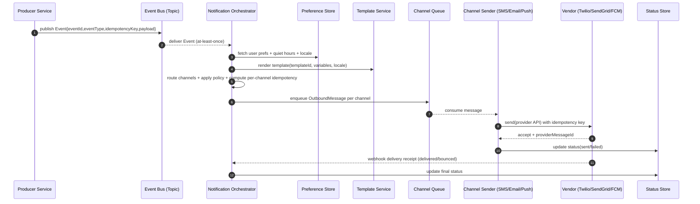

# Design: Notification System (SMS / Email / Push)

**Goal:** reliably deliver user notifications across channels (SMS/email/push) with correct preferences, idempotency, retries, and observability — without coupling product services to vendor APIs.

**Focus areas:** channels (SMS/email/push) · Observer pattern (event schema + subscribers) · templates & personalization · idempotency + retries + DLQ · APIs · flow diagram

---

## 1️⃣ High-Level Design (HLD)

### 1.1 Requirements

- **Functional**
  - send notifications across **SMS**, **Email**, **Push**
  - support **transactional** and **marketing** notifications (different rules)
  - user **preferences**: opt-in/out per channel, quiet hours, locale, topic subscriptions
  - **templating** with variables (name, OTP, orderId) and localization
  - dedupe/idempotency for “send” requests and event replays
  - delivery tracking: accepted/sent/delivered/bounced/failed
- **Non-functional**
  - high throughput (burst fanout), low latency for transactional (OTP)
  - at-least-once processing with **safe retries**
  - vendor isolation (swap Twilio/SendGrid/FCM/APNS)
  - strong observability (per channel latency, delivery rate, failure reasons)
  - compliance basics: unsubscribe, audit trail, PII handling

---

### 1.2 Architecture (event-driven, observer pattern)

**Key idea:** product services publish *events*; the notification system *observes* (subscribes) and routes messages to channel senders.

```
Product Services ── publish events ──▶ Event Bus / Topic
                                     │
                                     ▼
                            Notification Orchestrator
                              ├─ Preference service (read)
                              ├─ Template service (render)
                              ├─ Policy engine (quiet hours, marketing rules)
                              ├─ Routing (channels + fallbacks)
                              └─ Outbox/Queue per channel
                                     │
                 ┌───────────────────┼───────────────────┐
                 ▼                   ▼                   ▼
           SMS Sender            Email Sender         Push Sender
        (Twilio/etc)          (SendGrid/etc)        (FCM/APNS/etc)
                 │                   │                   │
                 └──── vendor webhooks/callbacks ────────┘
                                     ▼
                             Delivery Status Store
```

**Why observer pattern fits**
- Producers only emit domain events (e.g., `OrderPaid`), not “send email via SendGrid”.
- The notification layer has multiple observers (routes) and can add new channels without changing producers.

---

## 2️⃣ Observer Pattern (events + subscribers) — schema-first

### 2.1 Event envelope (canonical)

All events on the bus use a consistent envelope so consumers can route, dedupe, and trace.

```json
{
  "eventId": "evt_01J9G9M2H6K8K0B2V8D4S6A1QZ",
  "eventType": "order.paid",
  "occurredAtMs": 1763456789123,
  "producer": "payments-service",
  "version": 1,
  "tenantId": "t_42",
  "userId": "u_123",
  "correlationId": "corr_9f1c...",
  "idempotencyKey": "payments:order_7788:paid",
  "payload": {
    "orderId": "order_7788",
    "amount": 4999,
    "currency": "INR"
  }
}
```

**Notes**
- `eventId` is unique per publish; `idempotencyKey` is stable across retries/replays for dedupe.
- `version` enables safe schema evolution.

---

### 2.2 Subscription schema (the “observer registry”)

Each subscription says: “When event X happens, send notification Y using rules Z.”

```json
{
  "subscriptionId": "sub_1001",
  "enabled": true,
  "match": {
    "eventType": "order.paid",
    "tenantId": "t_42"
  },
  "audience": {
    "kind": "user",
    "userIdPath": "$.userId"
  },
  "notification": {
    "topic": "orders",
    "priority": "high",
    "channels": ["push", "email"],
    "fallback": ["sms"]
  },
  "template": {
    "templateId": "tmpl_order_paid_v3",
    "localeStrategy": "user_preference_then_default",
    "variables": {
      "orderId": "$.payload.orderId",
      "amount": "$.payload.amount",
      "currency": "$.payload.currency"
    }
  },
  "policy": {
    "respectQuietHours": true,
    "marketing": false,
    "maxAttemptsPerChannel": 5
  }
}
```

**Implementation note:** store subscriptions in DB + cache in orchestrator; push invalidations via config topic.

---

## 3️⃣ Channels (SMS / Email / Push)

### 3.1 Common channel interface (adapter pattern)

Each channel adapter translates a unified `OutboundMessage` into vendor-specific API calls.

```json
{
  "messageId": "msg_01J9G9...",
  "eventId": "evt_01J9G9...",
  "idempotencyKey": "payments:order_7788:paid:push",
  "tenantId": "t_42",
  "userId": "u_123",
  "channel": "push",
  "priority": "high",
  "to": {
    "email": null,
    "phoneE164": null,
    "deviceTokens": ["fcm_abc...", "apns_xyz..."]
  },
  "content": {
    "subject": "Payment received",
    "text": "Your order order_7788 is paid.",
    "html": null,
    "push": { "title": "Paid", "body": "Order order_7788", "deepLink": "app://orders/order_7788" }
  },
  "metadata": {
    "templateId": "tmpl_order_paid_v3",
    "locale": "en-IN",
    "traceId": "trace_..."
  }
}
```

---

### 3.2 SMS specifics

- **Constraints**
  - limited length; Unicode/concatenation changes cost/delivery
  - phone formatting (E.164), regional restrictions, DND rules
- **Best practices**
  - store `phoneE164` per user; validate at write time
  - keep templates short; avoid URL shorteners that trigger spam filters
  - vendor callback/webhook ingestion for delivery receipts

---

### 3.3 Email specifics

- **Constraints**
  - deliverability depends on SPF/DKIM/DMARC and content
  - needs unsubscribe links for marketing
- **Best practices**
  - transactional vs marketing sender domains
  - support both `text` and `html` bodies
  - bounce/complaint handling updates user preference (suppress list)

---

### 3.4 Push specifics

- **Constraints**
  - device token churn, per-device permissions, OS throttling
  - payload size limits; platform differences (APNS vs FCM)
- **Best practices**
  - token lifecycle: register, refresh, revoke
  - include `collapseKey` / `apns-collapse-id` for dedupe on device
  - deep links for a good UX

---

## 4️⃣ APIs (frontend / service facing)

### 4.1 Send API (direct request, synchronous enqueue)

**POST** `/v1/notifications:send`

```json
{
  "idempotencyKey": "checkout:order_7788:receipt",
  "tenantId": "t_42",
  "userId": "u_123",
  "topic": "orders",
  "priority": "high",
  "channels": ["email", "push"],
  "templateId": "tmpl_order_paid_v3",
  "variables": { "orderId": "order_7788", "amount": 4999, "currency": "INR" }
}
```

**Response — 202**

```json
{ "accepted": true, "notificationId": "ntf_01J9G9..." }
```

**Notes**
- Treat this API as “enqueue accepted”; actual delivery is async.
- Use request header `Idempotency-Key` or body `idempotencyKey` and store it.

---

### 4.2 Preferences API

**GET** `/v1/users/{userId}/notification-preferences`

**PUT** `/v1/users/{userId}/notification-preferences`

```json
{
  "channels": {
    "email": { "enabled": true },
    "sms": { "enabled": false },
    "push": { "enabled": true }
  },
  "topics": {
    "orders": { "enabled": true },
    "promotions": { "enabled": false }
  },
  "quietHours": { "enabled": true, "start": "22:00", "end": "08:00", "tz": "Asia/Kolkata" },
  "locale": "en-IN"
}
```

---

### 4.3 Device token API (push)

**POST** `/v1/users/{userId}/push-tokens`

```json
{ "provider": "fcm", "token": "fcm_abc...", "deviceId": "ios:uuid-123", "appVersion": "1.20.0" }
```

**DELETE** `/v1/users/{userId}/push-tokens/{tokenId}`

---

### 4.4 Delivery status API (debugging + UI)

**GET** `/v1/notifications/{notificationId}`

```json
{
  "notificationId": "ntf_01J9G9...",
  "topic": "orders",
  "userId": "u_123",
  "channels": [
    { "channel": "email", "state": "delivered", "providerMessageId": "sg_...", "lastError": null },
    { "channel": "push", "state": "sent", "providerMessageId": "fcm_...", "lastError": null }
  ],
  "createdAtMs": 1763456789123
}
```

---

## 5️⃣ End-to-end flow (diagram)

### 5.1 Event-driven flow (observer pattern)



---

## 6️⃣ Reliability: idempotency, retries, DLQ

### 6.1 Idempotency strategy

- **Inbound dedupe**
  - `Send API`: store `idempotencyKey -> notificationId` with TTL.
  - `Event bus`: store `eventId` or stable `idempotencyKey` in a dedupe store.
- **Per-channel idempotency**
  - compute `channelKey = {idempotencyKey}:{channel}` so email + push can both send once.
  - pass it to vendor if supported, else enforce in your sender store.

### 6.2 Retry model

- retry transient errors with exponential backoff + jitter
- stop on permanent errors (invalid email, revoked push token, spam block) and suppress future sends if needed
- after max attempts: send to **DLQ** with reason and last response

---

## 7️⃣ Data layer (minimal schema)

### 7.1 Tables / collections

- **`notification_requests`**
  - `notificationId`, `tenantId`, `userId`, `topic`, `priority`, `templateId`, `variables`, `createdAtMs`, `idempotencyKey`
- **`notification_messages`** (one per channel per notification)
  - `messageId`, `notificationId`, `channel`, `state`, `attempts`, `nextAttemptAtMs`, `provider`, `providerMessageId`, `lastError`
- **`user_notification_preferences`**
  - channel enabled flags, topics, quiet hours, locale, suppression reasons
- **`push_tokens`**
  - userId, provider, token, deviceId, lastSeenAtMs, revokedAtMs

---

## 8️⃣ LLD sketch (interfaces)

```ts
export type Channel = "sms" | "email" | "push"

export type NotificationEventEnvelope<TPayload> = {
  eventId: string
  eventType: string
  occurredAtMs: number
  producer: string
  version: number
  tenantId?: string
  userId?: string
  correlationId?: string
  idempotencyKey?: string
  payload: TPayload
}

export type OutboundMessage = {
  messageId: string
  notificationId: string
  channel: Channel
  idempotencyKey: string
  to: { email?: string; phoneE164?: string; deviceTokens?: string[] }
  content: { subject?: string; text?: string; html?: string; push?: { title: string; body: string; deepLink?: string } }
  metadata?: Record<string, string>
}

export interface ChannelSender {
  send(msg: OutboundMessage): Promise<{ providerMessageId: string }>
}
```

