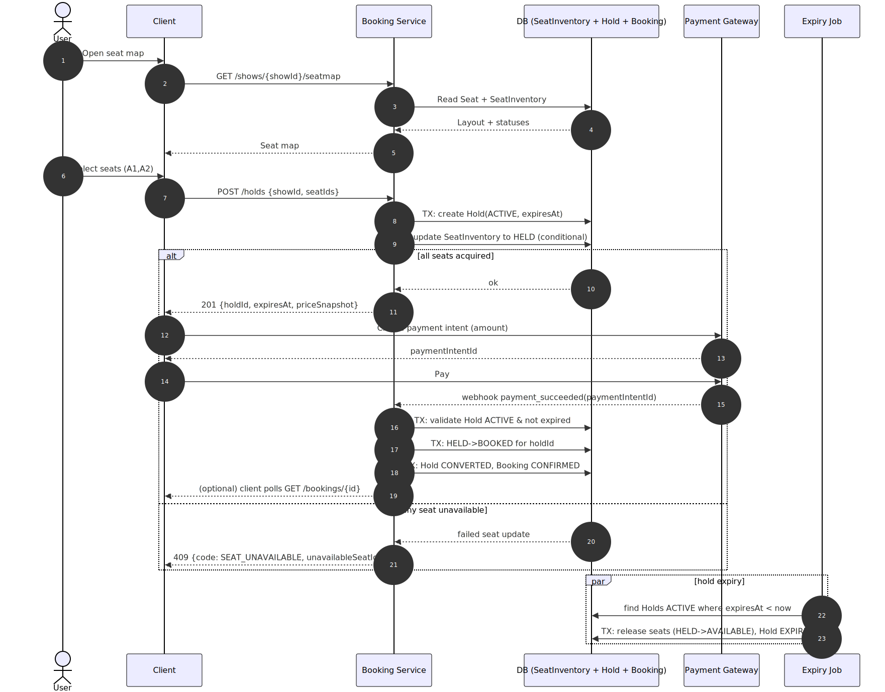
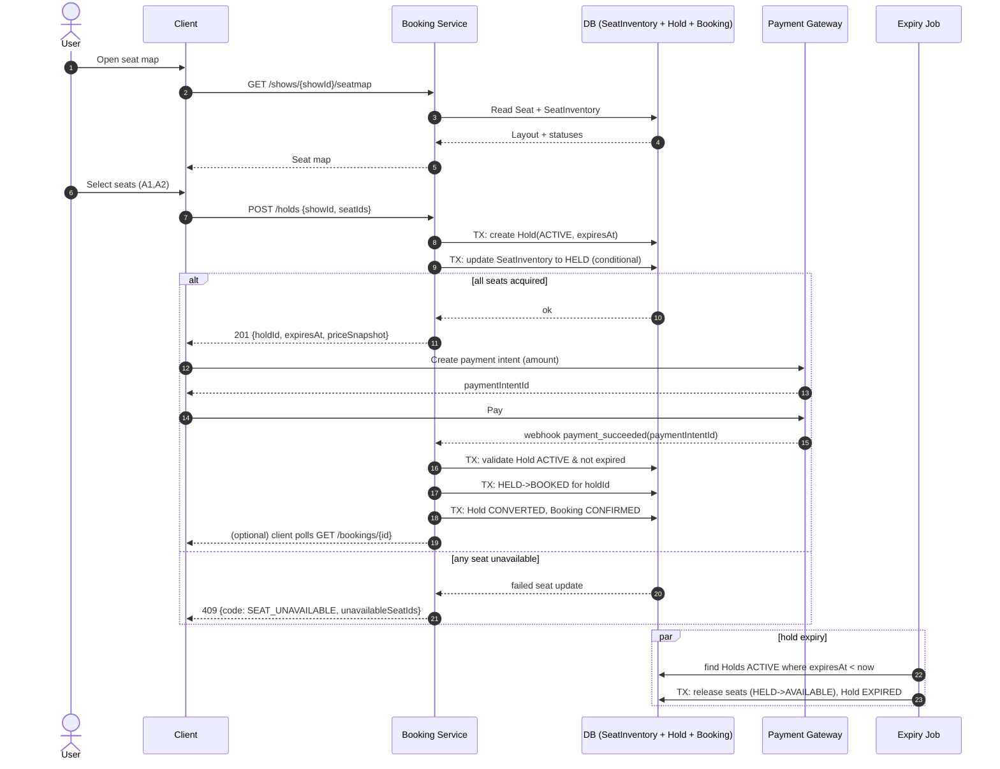
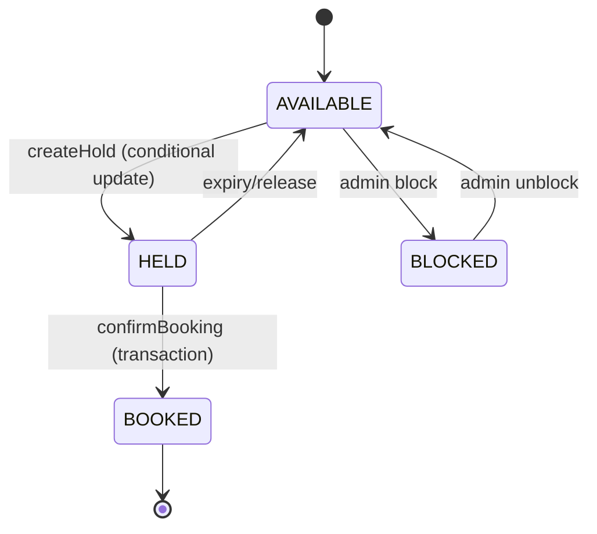
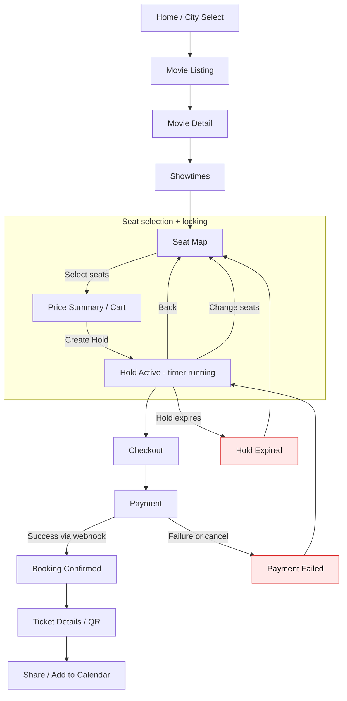

# Design: Movie Ticket Booking System (BookMyShow-like)

**Focus areas:** Theaters · Seats · Shows · Concurrency (locking, holds, idempotency)

---

## 1. Requirements (Clarifying Questions)

| Area | Questions |
|------|-----------|
| **Scope** | Are we designing only ticketing (seat selection + booking) or also catalog (movies, cities, discovery), food, subscriptions? |
| **Seat model** | Reserved seating only? Multiple seat categories (Gold/Platinum)? Wheelchair/accessible seats? Social distancing? |
| **Show model** | Multiple screens per theater? Same movie in multiple screens? Time zones / DST? |
| **Booking** | Single booking can include seats across multiple shows? (usually **no**). Partial booking allowed? |
| **Payment** | Pay-now only? Payment retries? Wallets/coupons? Refunds and cancellation policy? |
| **Scale** | Peak traffic: during blockbuster releases, how many concurrent seat selections per show? |
| **Consistency** | Strong consistency required for seat availability? Is “slightly stale” OK for browse/search, but strict for checkout? |
| **Fairness** | If many users attempt the same seat(s), should we guarantee first-come-first-serve? |
| **Reliability** | What happens when hold expires during payment? How do we prevent double-booking? |

**Assumptions for this design:** Multi-city; theaters have multiple screens; each show is on a specific screen at a start time; users pick **exact seats**; system supports **seat holds** with TTL (e.g., 5–10 minutes) during checkout; strict correctness for booking; search/browse can be cached.

---

## 2. Core Entities & Relationships

```
┌────────────────────────────────────────────────────────────────────────────────────────────────────┐
│                                 MOVIE TICKET BOOKING SYSTEM                                        │
├────────────────────────────────────────────────────────────────────────────────────────────────────┤
│  City                                                                                              │
│    ├── cityId: string                                                                              │
│    └── name                                                                                        │
├────────────────────────────────────────────────────────────────────────────────────────────────────┤
│  Theater                                                                                           │
│    ├── theaterId: string                                                                           │
│    ├── cityId: string                                                                              │
│    ├── name, address                                                                               │
│    └── screens: Screen[]                                                                           │
├────────────────────────────────────────────────────────────────────────────────────────────────────┤
│  Screen (auditorium)                                                                               │
│    ├── screenId: string                                                                            │
│    ├── theaterId: string                                                                           │
│    ├── name                                                                                        │
│    └── seatMap: Seat[]  (physical layout: rows, columns, category)                                 │
├────────────────────────────────────────────────────────────────────────────────────────────────────┤
│  Seat (physical)                                                                                   │
│    ├── seatId: string   (unique within screen)                                                     │
│    ├── screenId: string                                                                            │
│    ├── rowLabel: string, seatNumber: number                                                        │
│    ├── category: SeatCategory                                                                      │
│    └── isActive: boolean (maintenance/blocked)                                                     │
├────────────────────────────────────────────────────────────────────────────────────────────────────┤
│  Movie                                                                                             │
│    ├── movieId: string                                                                             │
│    ├── title, language, durationMins, certification                                                │
│    └── metadata                                                                                    │
├────────────────────────────────────────────────────────────────────────────────────────────────────┤
│  Show                                                                                              │
│    ├── showId: string                                                                              │
│    ├── movieId: string                                                                             │
│    ├── screenId: string                                                                            │
│    ├── startsAt: DateTime (local to theater)                                                       │
│    ├── endsAt: DateTime                                                                            │
│    ├── status: ShowStatus (SCHEDULED, CANCELLED, ENDED)                                            │
│    └── pricing: PriceRule[]  (by seat category, time, promo)                                       │
├────────────────────────────────────────────────────────────────────────────────────────────────────┤
│  SeatInventory (per-show seat state; source of truth for locking)                                  │
│    ├── showId: string                                                                              │
│    ├── seatId: string                                                                              │
│    ├── status: SeatStatus (AVAILABLE, HELD, BOOKED, BLOCKED)                                       │
│    ├── holdId: string | null                                                                       │
│    ├── version: number (optimistic concurrency)                                                    │
│    └── updatedAt                                                                                   │
├────────────────────────────────────────────────────────────────────────────────────────────────────┤
│  Hold (checkout lock, TTL)                                                                         │
│    ├── holdId: string                                                                              │
│    ├── showId: string                                                                              │
│    ├── userId: string                                                                              │
│    ├── seatIds: string[]                                                                           │
│    ├── status: HoldStatus (ACTIVE, EXPIRED, RELEASED, CONVERTED)                                   │
│    ├── expiresAt: DateTime                                                                         │
│    └── priceSnapshot: MoneyBreakdown                                                               │
├────────────────────────────────────────────────────────────────────────────────────────────────────┤
│  Booking (confirmed ticket purchase)                                                               │
│    ├── bookingId: string                                                                           │
│    ├── showId: string, userId: string                                                              │
│    ├── seatIds: string[]                                                                           │
│    ├── status: BookingStatus (PENDING_PAYMENT, CONFIRMED, CANCELLED, FAILED)                       │
│    ├── amount: MoneyBreakdown                                                                      │
│    ├── paymentRef: string | null                                                                   │
│    └── createdAt, updatedAt                                                                        │
└────────────────────────────────────────────────────────────────────────────────────────────────────┘
```

**Key modeling choice:** Keep `Seat` as the **physical layout**, and `SeatInventory(showId, seatId)` as the **per-show mutable state** used for concurrency.

---

## 3. Schema (JSON)

**Enums**

```json
{
  "SeatCategory": ["SILVER", "GOLD", "PLATINUM", "RECLINER", "ACCESSIBLE"],
  "SeatStatus": ["AVAILABLE", "HELD", "BOOKED", "BLOCKED"],
  "HoldStatus": ["ACTIVE", "EXPIRED", "RELEASED", "CONVERTED"],
  "ShowStatus": ["SCHEDULED", "CANCELLED", "ENDED"],
  "BookingStatus": ["PENDING_PAYMENT", "CONFIRMED", "CANCELLED", "FAILED"]
}
```

**Entity schemas**

```json
{
  "Theater": {
    "theaterId": "string",
    "cityId": "string",
    "name": "string",
    "address": "string"
  },
  "Screen": {
    "screenId": "string",
    "theaterId": "string",
    "name": "string"
  },
  "Seat": {
    "seatId": "string",
    "screenId": "string",
    "rowLabel": "string",
    "seatNumber": "number",
    "category": "SeatCategory",
    "isActive": "boolean"
  },
  "Movie": {
    "movieId": "string",
    "title": "string",
    "language": "string",
    "durationMins": "number"
  },
  "Show": {
    "showId": "string",
    "movieId": "string",
    "screenId": "string",
    "startsAt": "string",
    "endsAt": "string",
    "status": "ShowStatus",
    "pricing": [{
      "seatCategory": "SeatCategory",
      "basePrice": "number",
      "currency": "string"
    }]
  },
  "SeatInventory": {
    "showId": "string",
    "seatId": "string",
    "status": "SeatStatus",
    "holdId": "string | null",
    "version": "number",
    "updatedAt": "string"
  },
  "Hold": {
    "holdId": "string",
    "showId": "string",
    "userId": "string",
    "seatIds": ["string"],
    "status": "HoldStatus",
    "expiresAt": "string",
    "priceSnapshot": {
      "subtotal": "number",
      "taxes": "number",
      "fees": "number",
      "discount": "number",
      "total": "number",
      "currency": "string"
    }
  },
  "Booking": {
    "bookingId": "string",
    "showId": "string",
    "userId": "string",
    "seatIds": ["string"],
    "status": "BookingStatus",
    "amount": "Hold.priceSnapshot",
    "paymentRef": "string | null",
    "createdAt": "string",
    "updatedAt": "string"
  }
}
```

---

## 4. Theaters, Screens, and Seat Maps

### 4.1 Seat identity

Use a stable `seatId` per screen (e.g., `A-10`, or a UUID), and keep display attributes (`rowLabel`, `seatNumber`) on `Seat`. For UI seat maps, you’ll typically also store `x,y` coordinates or a grid position.

### 4.2 Seat categories & pricing

Price is derived from `Show.pricing` (by `SeatCategory`) + fees/taxes + discounts. Store the computed values into a **snapshot** on `Hold` (and later `Booking`) to make billing consistent even if pricing rules change mid-checkout.

---

## 5. Shows

### 5.1 Show invariants

- A show belongs to exactly one `screenId`.
- Shows in the same screen must not overlap in time.
- Seat availability for a show is determined exclusively by `SeatInventory(showId, seatId)`.

### 5.2 Pre-creating seat inventory (recommended)

When creating a show, initialize `SeatInventory` rows for all active seats on the screen:

- Pros: simplest locking semantics, easy queries for seat map
- Cons: many rows (but bounded by seats per screen; typically manageable)

Alternative is “sparse” inventory (only store non-available states), but then holds/booking must be carefully modeled.

---

## 6. Concurrency & Correctness (The Core)

### 6.1 Seat lifecycle

For a given `(showId, seatId)`:

`AVAILABLE → HELD → BOOKED`

Also:

- `AVAILABLE → BLOCKED` (maintenance/admin)
- `HELD → AVAILABLE` (expiry/release)
- `HELD → BOOKED` (successful payment/confirmation)

### 6.2 Why we need holds

Browsing seat maps is read-heavy and concurrent. The race happens when many users try to purchase the same seats.

**Goal:** once a user selects seats and enters checkout, those seats should be temporarily unavailable to others for a short TTL.

### 6.3 Strategy A (practical default): DB transaction with conditional updates

**Data:** `seat_inventory(show_id, seat_id, status, hold_id, version, updated_at)`

Hold acquisition for requested seats:

1. Create `Hold` row with `ACTIVE` and `expiresAt = now + TTL`.
2. In a single transaction, for each requested seat:
   - Update only if the seat is currently available:
     - `UPDATE seat_inventory SET status='HELD', hold_id=:holdId, version=version+1 WHERE show_id=:showId AND seat_id=:seatId AND status='AVAILABLE';`
   - Verify updated row count == 1 for every seat.
3. If any seat fails, rollback and return “some seats unavailable” (or return which seats failed).

**Why it works:** the update is atomic per row; no double-hold is possible.

**Optional:** use `SELECT ... FOR UPDATE` to lock rows first, but conditional updates are often enough and simpler.

### 6.4 Confirm booking (convert hold → booked) with idempotency

When payment succeeds, confirm atomically:

1. Validate hold is `ACTIVE` and not expired.
2. Create `Booking` row as `PENDING_PAYMENT` (or create only after payment callback; both work).
3. In a transaction:
   - Transition all `seat_inventory` rows with `hold_id = :holdId` from `HELD → BOOKED`.
   - Ensure **every seat** was updated.
   - Mark `Hold` as `CONVERTED`.
   - Mark `Booking` as `CONFIRMED`.

**Idempotency:** require an idempotency key on `confirmBooking` (e.g., `paymentIntentId` or client-generated `requestId`), and enforce a unique constraint so retries don’t create duplicate bookings.

### 6.5 Hold expiry (release) without leaking seats

Seat holds must expire even if the client disappears.

Approach:

- Background job scans expired holds: `status=ACTIVE AND expiresAt < now`
- For each expired hold (transaction):
  - Update matching seat_inventory: `HELD → AVAILABLE` where `hold_id=:holdId`
  - Set hold status to `EXPIRED`

**Safety:** make this operation idempotent; repeated runs should not double-release (e.g., only update rows still `HELD` for that `hold_id`).

### 6.6 Common concurrency edge cases to explicitly handle

- **User opens seat map in 2 tabs**: hold creation should be idempotent per “cart session” or you should allow multiple holds but enforce per-user limits.
- **Hold expires during payment**: payment callback arrives after expiry; confirm must fail, and refund/void may be needed.
- **Partial seat acquisition**: if one seat fails, the whole hold should fail (simpler) unless you support “best effort” seat sets.
- **Server retries/timeouts**: all state transitions must be idempotent (hold create, confirm, cancel).

---

## 7. Flow Diagrams

### 7.1 Seat selection → hold → payment → booking (sequence)

**SVG export:** `src/systemDesign/assets/movieticket-flow-sequence.svg`





### 7.2 Seat state machine (per show-seat)

**SVG export:** `src/systemDesign/assets/movieticket-seat-state.svg`





### 7.3 UI flow (BookMyShow-like)

**SVG export:** `src/systemDesign/assets/movieticket-ui-flow.svg`





## 7. Key APIs (Minimal)

### Catalog / discovery (read heavy)

- `GET /cities`
- `GET /cities/{cityId}/movies?date=YYYY-MM-DD`
- `GET /movies/{movieId}/shows?cityId=...&date=YYYY-MM-DD`

**Example response — `GET /movies/{movieId}/shows?cityId=BLR&date=2026-03-17`**

```json
{
  "movieId": "mv_123",
  "cityId": "BLR",
  "date": "2026-03-17",
  "shows": [
    {
      "showId": "sh_9001",
      "theater": { "theaterId": "th_10", "name": "PVR Orion" },
      "screen": { "screenId": "sc_2", "name": "Audi 2" },
      "startsAt": "2026-03-17T19:30:00+05:30",
      "endsAt": "2026-03-17T22:15:00+05:30",
      "status": "SCHEDULED",
      "minPrice": { "amount": 180, "currency": "INR" }
    }
  ]
}
```

### Seat map + availability

- `GET /shows/{showId}/seatmap`
  - Returns seat layout + current `SeatStatus` for each seat (or only non-available seats + client merges)

**Example response — `GET /shows/sh_9001/seatmap`**

```json
{
  "showId": "sh_9001",
  "screen": { "screenId": "sc_2", "name": "Audi 2" },
  "legend": {
    "SeatStatus": ["AVAILABLE", "HELD", "BOOKED", "BLOCKED"],
    "SeatCategory": ["SILVER", "GOLD", "PLATINUM", "RECLINER", "ACCESSIBLE"]
  },
  "seats": [
    { "seatId": "A1", "rowLabel": "A", "seatNumber": 1, "category": "GOLD", "status": "AVAILABLE" },
    { "seatId": "A2", "rowLabel": "A", "seatNumber": 2, "category": "GOLD", "status": "HELD", "holdId": "h_778" },
    { "seatId": "A3", "rowLabel": "A", "seatNumber": 3, "category": "GOLD", "status": "BOOKED" }
  ],
  "serverTime": "2026-03-17T18:12:04+05:30"
}
```

### Quote (optional but useful)

- `POST /shows/{showId}/quote`
  - Body: seatIds[], couponCode?
  - Returns: price breakdown + `quoteId` + `expiresAt` (short)

**Example request**

```json
{
  "seatIds": ["A1", "A2"],
  "couponCode": "MOVIE50"
}
```

**Example response**

```json
{
  "quoteId": "q_5001",
  "showId": "sh_9001",
  "seatIds": ["A1", "A2"],
  "pricingVersion": "pv_2026_03_17_01",
  "expiresAt": "2026-03-17T18:22:04+05:30",
  "price": {
    "subtotal": 600,
    "taxes": 54,
    "fees": 20,
    "discount": 50,
    "total": 624,
    "currency": "INR"
  }
}
```

### Holds

- `POST /holds`
  - Body: showId, seatIds[], userId, quoteId? (or inline price inputs)
  - Returns: holdId, expiresAt, priceSnapshot

- `DELETE /holds/{holdId}`
  - Releases a hold early (user backs out)

**Example request — `POST /holds`**

```json
{
  "showId": "sh_9001",
  "userId": "u_101",
  "seatIds": ["A1", "A2"],
  "quoteId": "q_5001",
  "idempotencyKey": "hold_u_101_sh_9001_A1_A2_v1"
}
```

**Example response — success**

```json
{
  "holdId": "h_900",
  "status": "ACTIVE",
  "showId": "sh_9001",
  "userId": "u_101",
  "seatIds": ["A1", "A2"],
  "expiresAt": "2026-03-17T18:22:04+05:30",
  "priceSnapshot": {
    "subtotal": 600,
    "taxes": 54,
    "fees": 20,
    "discount": 50,
    "total": 624,
    "currency": "INR"
  }
}
```

**Example response — seat unavailable (`409`)**

```json
{
  "error": {
    "code": "SEAT_UNAVAILABLE",
    "message": "One or more seats are no longer available.",
    "showId": "sh_9001",
    "unavailableSeatIds": ["A2"]
  }
}
```

### Booking

- `POST /bookings`
  - Body: holdId, paymentIntentId, idempotencyKey
  - Returns: bookingId, status

- `GET /bookings/{bookingId}`

**Example request — `POST /bookings`**

```json
{
  "holdId": "h_900",
  "paymentIntentId": "pi_777",
  "idempotencyKey": "confirm_pi_777"
}
```

**Example response — success**

```json
{
  "bookingId": "b_10001",
  "status": "CONFIRMED",
  "showId": "sh_9001",
  "userId": "u_101",
  "seatIds": ["A1", "A2"],
  "amount": {
    "subtotal": 600,
    "taxes": 54,
    "fees": 20,
    "discount": 50,
    "total": 624,
    "currency": "INR"
  },
  "paymentRef": "pi_777",
  "createdAt": "2026-03-17T18:14:30+05:30"
}
```

**Example response — hold expired (`410`)**

```json
{
  "error": {
    "code": "HOLD_EXPIRED",
    "message": "Hold expired. Please select seats again.",
    "holdId": "h_900"
  }
}
```

---

## 8. Key Flows

### 8.1 Browse → select seats → hold → pay → confirm

1. User opens show seat map (read path).
2. User selects seats.
3. Client calls `POST /holds` (write path; locks seats).
4. Client proceeds to payment.
5. On payment success, client (or payment webhook) calls `POST /bookings` to convert hold → booking.

### 8.2 Payment webhook vs client confirm

Best practice is to treat payment provider webhooks as source of truth for payment success, and make booking confirmation triggered by the webhook (with idempotency). The client call can be a “status check” rather than the final authority.

### 8.3 Show cancellation

If a show is cancelled:

- Mark show `CANCELLED`
- Refund all `CONFIRMED` bookings (async)
- Release all `HELD` seats (expire holds early)
- Seat map becomes read-only

---

## 9. Data Model Notes (Indexes & Constraints)

Suggested relational tables:

- `theater(theater_id, city_id, name, address, ...)`
- `screen(screen_id, theater_id, name, ...)`
- `seat(seat_id, screen_id, row_label, seat_number, category, is_active, ...)`
- `movie(movie_id, ...)`
- `show(show_id, movie_id, screen_id, starts_at, ends_at, status, ...)`
- `seat_inventory(show_id, seat_id, status, hold_id, version, updated_at)`
  - PK `(show_id, seat_id)`
  - Index `(show_id, status)` for fast seat map filtering
  - Index `(hold_id)` for release/convert operations
- `hold(hold_id, show_id, user_id, status, expires_at, price_snapshot, created_at)`
  - Index `(show_id, status, expires_at)`
- `booking(booking_id, show_id, user_id, status, amount, payment_ref, idempotency_key, created_at)`
  - Unique `(idempotency_key)` (or `(payment_ref)` depending on provider)

---

## 10. Testing Focus (Concurrency)

- **Double-book prevention**: two users attempt same seat at same time → at most one hold/booking succeeds.
- **Hold TTL**: held seats return to available after expiry; no seat stuck in HELD.
- **Idempotency**: retries of `POST /holds` and `POST /bookings` don’t create duplicates or corrupt state.
- **All-or-nothing**: hold acquisition for N seats is atomic (either all held or none).
- **Late payment**: payment success after hold expiry is handled deterministically (no booking, trigger void/refund).

This design keeps seat correctness simple: mutable per-show seat state in `SeatInventory`, short-lived holds with TTL, and transactional state transitions with idempotency.

