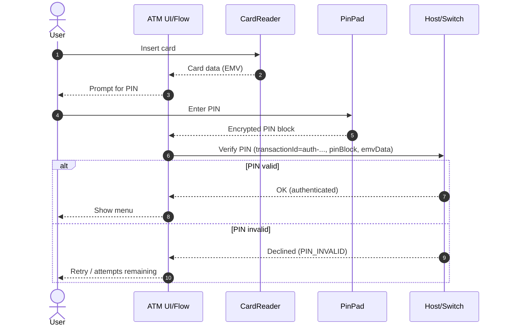
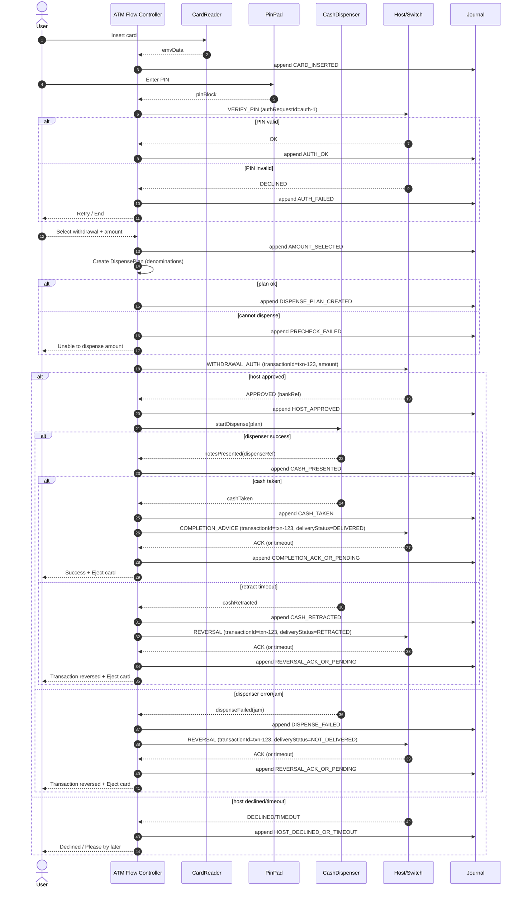
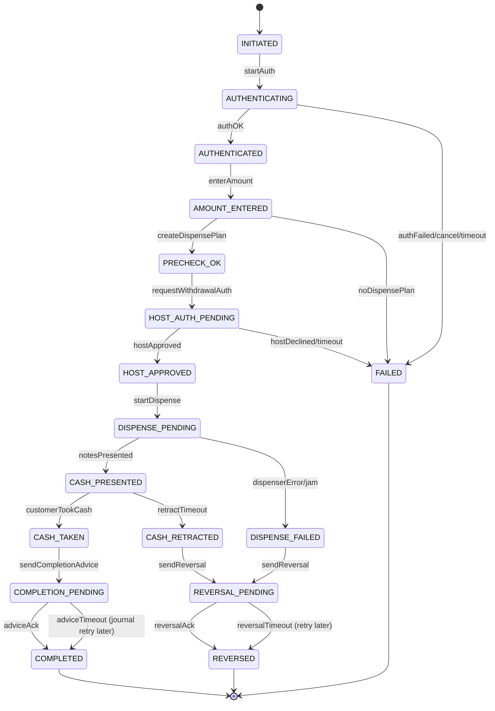

# Design: ATM Machine

**Focus areas:** Authentication · Cash dispensing · Transaction states (timeouts, reversals, idempotency)

---

## 1. Requirements (Clarifying Questions)

| Area | Questions |
|------|-----------|
| **Scope** | Withdrawal only, or also balance inquiry, deposits, PIN change, mini statement, transfers? |
| **Cards** | Chip (EMV) + PIN only, or also magstripe fallback? Contactless (NFC)? |
| **Auth** | How many PIN retries before card capture? PIN block format + HSM integration required? |
| **Cash** | Single cassette or multiple denominations? Partial dispense allowed? |
| **Reliability** | What if cash is dispensed but debit fails (or vice versa)? Who owns reconciliation? |
| **Connectivity** | Offline mode allowed? What’s the retry/backoff strategy to the switch/bank? |
| **Limits** | Per-transaction/day limits, per-card limits, fraud/risk checks? |
| **Receipts** | Optional receipt? Journal required for every action? |
| **Observability** | What telemetry is required (cash counts, errors, tamper events, latency)? |

**Assumptions for this design:** ATM supports **withdrawal** + **balance inquiry**; card is EMV chip + PIN; ATM connects to a bank switch/host; cash is dispensed from multiple cassettes (denominations); system must be safe under retries, timeouts, and partial hardware failures.

---

## 2. High-Level Architecture

At the ATM, software is typically split into (1) a UI/flow controller and (2) device drivers. The ATM then talks to external systems for authorization and settlement.

```
┌───────────────────────────────────────────────────────────────────────────────┐
│                                     ATM                                       │
├───────────────────────────────────────────────────────────────────────────────┤
│  UI + Flow Orchestrator                                                       │
│    - SessionManager                                                           │
│    - AuthController (PIN attempts, card state)                                │
│    - TransactionController (state machine)                                    │
│    - ReceiptController                                                        │
│    - JournalLogger (append-only)                                              │
│                                                                               │
│  Device Layer (Drivers)                                                       │
│    - CardReader (insert/eject/capture, read chip)                             │
│    - PinPad (secure entry)                                                    │
│    - CashDispenser (cassettes, sensors, dispense)                             │
│    - Printer (optional)                                                       │
│    - Display/Touch/Keypad                                                     │
│    - Sensors (door, tamper, cash-in-tray, etc.)                               │
└───────────────────────────────────────────────────────────────────────────────┘
            │
            │ ISO 8583 / bank protocol (or modern API gateway)
            ▼
┌───────────────────────────┐     ┌───────────────────────────────────────────┐
│ Switch / Payment Network  │────▶│ Issuer Bank Host                          │
│ - routing, retry rules    │     │ - auth, limits, ledger, core banking      │
└───────────────────────────┘     └───────────────────────────────────────────┘
            │
            └──────────────▶ Monitoring + Reconciliation (ops back-office)
```

**Key principle:** The ATM must be safe under unreliable networks and unreliable devices. That means:

- **Every meaningful step is journaled** (append-only, local durable store).
- **Transaction state is explicit** (state machine).
- **External calls are idempotent** (same request can be safely retried).
- **Dispense is tightly coupled to authorization** (or reversed if not).

---

## 3. Core Entities & Relationships

```
┌──────────────────────────────────────────────────────────────────────────────────┐
│                                          ATM                                     │
├──────────────────────────────────────────────────────────────────────────────────┤
│  Atm                                                                             │
│    - atmId: string                                                               │
│    - location: string                                                            │
│    - status: AtmStatus (IN_SERVICE, OUT_OF_SERVICE, DEGRADED)                    │
│    - cashCassettes: CashCassette[]                                               │
│    - config: limits, timeouts, supportedTransactions                             │
├──────────────────────────────────────────────────────────────────────────────────┤
│  Card                                                                            │
│    - panToken: string (store token, not raw PAN)                                 │
│    - expiryMonthYear: string                                                     │
│    - cardType: CardType (DEBIT, CREDIT)                                          │
│    - issuerId: string                                                            │
│    - emvData: opaque                                                             │
├──────────────────────────────────────────────────────────────────────────────────┤
│  Session                                                                         │
│    - sessionId: string                                                           │
│    - atmId: string                                                               │
│    - card: Card                                                                  │
│    - state: SessionState (CARD_INSERTED, AUTHENTICATED, ENDED)                   │
│    - pinAttemptsRemaining: number                                                │
│    - startedAt, endedAt                                                          │
├──────────────────────────────────────────────────────────────────────────────────┤
│  Transaction                                                                     │
│    - transactionId: string (stable id for idempotency)                           │
│    - sessionId: string                                                           │
│    - type: TxnType (WITHDRAWAL, BALANCE_INQUIRY)                                 │
│    - amount: Money | null                                                        │
│    - state: TxnState                                                             │
│    - bankRef: string | null (host reference)                                     │
│    - dispenseRef: string | null (device reference)                               │
│    - reversalRef: string | null                                                  │
│    - error: TxnError | null                                                      │
│    - createdAt, updatedAt                                                        │
├──────────────────────────────────────────────────────────────────────────────────┤
│  CashCassette                                                                    │
│    - cassetteId: string                                                          │
│    - denomination: number (e.g., 100, 500, 2000)                                 │
│    - currency: string                                                            │
│    - availableNotes: number                                                      │
│    - status: CassetteStatus (OK, LOW, EMPTY, JAMMED, OUT)                        │
├──────────────────────────────────────────────────────────────────────────────────┤
│  DispensePlan                                                                    │
│    - transactionId: string                                                       │
│    - requestedAmount: Money                                                      │
│    - items: {cassetteId, denomination, noteCount}[]                              │
│    - status: DispensePlanStatus (CREATED, EXECUTED, FAILED)                      │
└──────────────────────────────────────────────────────────────────────────────────┘
```

**Design choice:** We treat **`Transaction.transactionId`** as the idempotency anchor across all retries and logs. The ATM generates it once and reuses it for host calls and reversals.

---

## 4. Schema (JSON)

### 4.1 Enums

```json
{
  "AtmStatus": ["IN_SERVICE", "OUT_OF_SERVICE", "DEGRADED"],
  "SessionState": ["CARD_INSERTED", "AUTHENTICATED", "ENDED"],
  "TxnType": ["WITHDRAWAL", "BALANCE_INQUIRY"],
  "TxnState": [
    "INITIATED",
    "AUTHENTICATING",
    "AUTHENTICATED",
    "AMOUNT_ENTERED",
    "PRECHECK_OK",
    "HOST_AUTH_PENDING",
    "HOST_APPROVED",
    "DISPENSE_PENDING",
    "CASH_PRESENTED",
    "CASH_TAKEN",
    "CASH_RETRACTED",
    "COMPLETION_PENDING",
    "REVERSAL_PENDING",
    "COMPLETED",
    "REVERSED",
    "DISPENSE_FAILED",
    "FAILED"
  ],
  "CassetteStatus": ["OK", "LOW", "EMPTY", "JAMMED", "OUT"],
  "DispensePlanStatus": ["CREATED", "EXECUTED", "FAILED"],
  "DeliveryStatus": ["DELIVERED", "NOT_DELIVERED", "RETRACTED"],
  "HostResult": ["APPROVED", "DECLINED", "TIMEOUT", "ERROR"]
}
```

### 4.2 Entity schemas (minimal)

```json
{
  "Money": { "amount": "number", "currency": "string" },

  "Card": {
    "panToken": "string",
    "expiryMonthYear": "string",
    "issuerId": "string",
    "cardType": "DEBIT | CREDIT",
    "emvData": "opaque"
  },

  "Session": {
    "sessionId": "string",
    "atmId": "string",
    "card": "Card",
    "state": "SessionState",
    "pinAttemptsRemaining": "number",
    "startedAt": "string",
    "endedAt": "string | null"
  },

  "CashCassette": {
    "cassetteId": "string",
    "denomination": "number",
    "currency": "string",
    "availableNotes": "number",
    "status": "CassetteStatus"
  },

  "DispensePlan": {
    "transactionId": "string",
    "requestedAmount": "Money",
    "items": [
      { "cassetteId": "string", "denomination": "number", "noteCount": "number" }
    ],
    "status": "DispensePlanStatus"
  },

  "Transaction": {
    "transactionId": "string",
    "sessionId": "string",
    "type": "TxnType",
    "amount": "Money | null",
    "state": "TxnState",
    "bankRef": "string | null",
    "dispenseRef": "string | null",
    "reversalRef": "string | null",
    "error": {
      "code": "string",
      "message": "string",
      "at": "string"
    },
    "createdAt": "string",
    "updatedAt": "string"
  }
}
```

### 4.3 Journal event schema (append-only)

```json
{
  "JournalEvent": {
    "eventId": "string",
    "atmId": "string",
    "sessionId": "string | null",
    "transactionId": "string | null",
    "type": "string",
    "timestamp": "string",
    "payload": "object",
    "prevHash": "string | null",
    "hash": "string"
  }
}
```

### 4.4 Host message schema (conceptual, protocol-agnostic)

```json
{
  "HostRequest": {
    "transactionId": "string",
    "atmId": "string",
    "type": "VERIFY_PIN | BALANCE_INQUIRY | WITHDRAWAL_AUTH | COMPLETION_ADVICE | REVERSAL | STATUS_INQUIRY",
    "card": { "panToken": "string", "emvData": "opaque" },
    "pinBlock": "opaque | null",
    "amount": { "amount": "number", "currency": "string" },
    "deliveryStatus": "DeliveryStatus | null",
    "messageSequence": "number"
  },
  "HostResponse": {
    "transactionId": "string",
    "result": "HostResult",
    "responseCode": "string",
    "bankRef": "string | null",
    "balance": { "amount": "number", "currency": "string" },
    "limits": { "dailyRemaining": "number | null" },
    "message": "string | null"
  }
}
```

---

## 5. Authentication (Card + PIN)

### 4.1 Goals

- Authenticate user without leaking secrets.
- Enforce retry policy and card retention rules.
- Remain correct under PIN pad errors, user cancel, and timeouts.

### 4.2 PIN handling and security boundaries

- PIN entry happens on the **secure PIN pad**.
- ATM app never sees raw PIN; it receives a **PIN block** (encrypted) produced by the PIN pad, typically using keys managed by an **HSM** or security module.
- ATM sends PIN block + EMV/track data to the host for validation.

### 4.3 Card/PIN attempt policy (example)

- Up to 3 tries.
- After max attempts:
  - If policy is **capture**: retain card in the ATM (CardReader captures).
  - Else: eject card and block session.

### 4.4 Authentication flow (sequence)



**Important:** Even authentication should be idempotent (host can safely process duplicate `VerifyPIN` messages for the same `transactionId`) or the ATM should generate a fresh auth request id each attempt but still journal it to avoid “ghost retries”.

---

## 6. Cash Dispensing (Withdrawal) — The Critical Path

### 5.1 Goals and invariants

- Never “create” money: dispensed cash must reconcile with host ledger.
- Never “lose” money: if cash was not delivered, customer should not be debited (or must be reversed).
- Make every step detectable via journal so ops can reconcile.

### 5.2 Typical withdrawal flow (host-first)

Most networks prefer **authorize/debit first**, then dispense, then confirm/completion message:

1. **Pre-check**: ATM can dispense amount (cassette availability).
2. **Host authorization**: verify balance, limits, fraud rules; debit/reserve funds.
3. **Dispense**: hardware executes plan; sensors confirm notes picked and presented.
4. **Customer takes cash**: cash-out sensor confirms removal.
5. **Completion advice**: notify host of completion (and/or delivery status).

This reduces “cash-out without debit” risk, but creates “debit without cash” which must be handled with reversals and disputes. The design must handle both.

### 5.3 Dispense planning (denominations)

Given available notes per cassette, compute a plan that:

- Matches requested amount exactly.
- Prioritizes larger denominations (fewer notes) but respects:
  - maximum notes per dispense
  - “low” cassettes (avoid draining them completely if configured)
  - cassette health (avoid JAMMED)

If no plan exists, decline early with “unable to dispense requested amount”.

---

## 7. End-to-End Flow (Withdrawal)

### 7.1 Sequence (host-first + advice/reversal)



### 7.2 Flow ↔ state mapping (quick)

- `WITHDRAWAL_AUTH` sent → `HOST_AUTH_PENDING`
- `HOST_APPROVED` received → `HOST_APPROVED`
- `startDispense` → `DISPENSE_PENDING`
- `notesPresented` → `CASH_PRESENTED`
- `cashTaken` → `CASH_TAKEN` → `COMPLETION_PENDING`
- `cashRetracted` or `dispenseFailed` → `REVERSAL_PENDING`

---

## 8. Transaction State Machine

### 8.1 Transaction states

The ATM must be explicit about where it is, and what compensations are allowed.



### 8.2 Why “COMPLETION_PENDING” and “REVERSAL_PENDING” matter

Network calls can time out after the bank has processed them. If the ATM simply “fails fast”, it risks duplicating debits or missing reversals.

- **Completion advice** (or delivery status) should be retried until acked, using the same `transactionId`.
- **Reversal** is a compensation message that must also be retried until acked.

The ATM can safely end the user interaction while background retries continue, because the **journal has the durable state**.

---

## 9. Journal Logging (Durable, Append-Only)

### 9.1 What to journal

Journal every state transition and every external/device action, with enough data to reconcile:

- `transactionId`, `sessionId`, `atmId`
- state transition: from, to, timestamp
- request/response (sanitized) to host:
  - amounts, response codes, host reference
- device events:
  - dispense started, notes picked, notes presented, cash taken, retracted
  - errors: jam, empty cassette, sensor failure

### 9.2 Why journal is essential

After a crash/reboot, ATM must resume:

- If state was `HOST_APPROVED` but dispense not started: either proceed to dispense (if safe) or reverse depending on policy.
- If state was `DISPENSE_PENDING` with unknown outcome: consult device status + sensors + last journaled device event.
- If state was `REVERSAL_PENDING`: keep retrying reversal until acknowledged.

---

## 10. Failure Handling (Intermediate → Advanced)

### 10.1 Failure matrix (high-signal cases)

| Failure | What happened | Correct action |
|--------|---------------|----------------|
| **Host timeout after request** | Unknown if debit happened | Query host by `transactionId` (if supported). Otherwise treat as “in doubt”: do **not dispense**, move to `REVERSAL_PENDING` or “pending investigation” depending on network rules. |
| **Host approved, dispense jam** | Debit happened, no cash | Move to `REVERSAL_PENDING` and retry reversal until ack. Journal device error + cassette state. |
| **Cash presented, customer didn’t take** | Debit happened, cash retracted | Move to `REVERSAL_PENDING` (or if network supports “partial” advice, send delivery status = retracted). |
| **Cash dispensed, completion advice timeout** | Cash taken, debit happened, host may or may not have recorded completion | End UX as success (if cash taken), set `COMPLETION_PENDING` and retry advice later. |
| **ATM power loss mid-dispense** | Uncertain cash outcome | On reboot, inspect dispenser sensors + retract bin counters; decide between completion advice or reversal (policy + evidence). |

### 10.2 “In doubt” handling strategy

This is where designs differ in seniority. A robust approach:

- Prefer protocols where host supports:
  - **transaction status inquiry** by `transactionId`
  - explicit **reversal** semantics
  - unique host reference numbers
- If inquiry is unavailable:
  - choose a conservative policy: **never dispense on uncertain debit**.
  - rely on bank reversal rules (still must retry reversal if you did send it).

### 10.3 Idempotency rules

ATM requests must include:

- Stable `transactionId`
- Optional monotonically increasing `messageSequence` for host auditing

Host side should enforce:

- “same `transactionId` + same amount” returns the original decision (duplicate detection)
- “same `transactionId` but different amount” is rejected (protocol error)

---

## 11. Minimal APIs / Messages (Conceptual)

Many ATM deployments use ISO 8583. Conceptually, the ATM needs these message types:

- **Verify PIN**
- **Balance Inquiry**
- **Withdrawal Authorization** (debit/reserve)
- **Completion Advice** (cash delivered)
- **Reversal** (cash not delivered or retracted)
- **Status Inquiry** (optional but extremely useful)

Regardless of protocol, the essential fields are:

- `transactionId`
- `atmId`
- card token + EMV data
- amount + currency
- response code + host reference
- delivery status (delivered / not delivered / retracted)

---

## 12. Key Scenarios (Walkthroughs)

### 12.1 Happy path withdrawal

1. Card inserted, PIN verified.
2. Amount entered, dispense plan created.
3. Host approves withdrawal (debit/reserve).
4. Dispenser presents cash; customer takes it.
5. Completion advice sent (or queued if timeout).
6. Receipt printed (optional) and card ejected.

### 12.2 Debit succeeded, dispense failed (reversal)

1. Host approves.
2. Dispenser jams before presenting cash.
3. ATM transitions to `REVERSAL_PENDING`, sends reversal.
4. Until reversal ack:
   - keep retrying in background (even after session ends)
   - mark ATM as `DEGRADED` if repeated jams

### 12.3 Cash presented but not taken (retract + reversal)

1. Cash presented.
2. Customer times out, ATM retracts cash.
3. Treat as “not delivered” and send reversal (or delivery advice = retracted).

---

## 13. Non-Functional Requirements

- **Availability**: UI should remain responsive even if host is slow; timeouts are explicit and drive state.
- **Safety**: hardware faults must put ATM into safe mode (`OUT_OF_SERVICE`) if dispensing becomes unreliable.
- **Auditability**: journal is tamper-evident (hash chaining per entry is a common approach).
- **Latency**: keep host call timeouts reasonable (e.g., 10–20s) with user-friendly UI.
- **Security**: protect keys, never store PAN/PIN, secure boot if required, log sanitization.

---

## 14. Testing Focus (State + Failure)

- **Idempotency**: retry host calls with same `transactionId` → no double debit.
- **Crash recovery**: reboot in each state and verify correct continuation (or compensation).
- **Dispenser faults**: simulate jam/empty/retract and ensure reversal/advice correctness.
- **Timeouts**: host timeout, device timeout (cash-taken), printer errors.
- **PIN policy**: attempt limits, card capture/eject, session termination.

